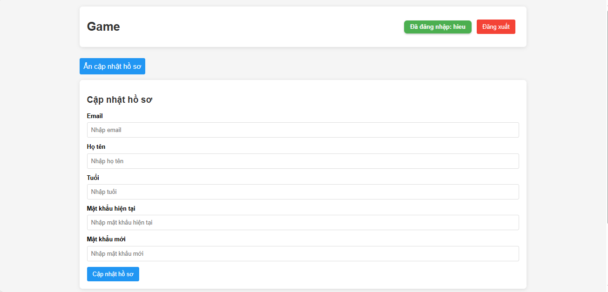
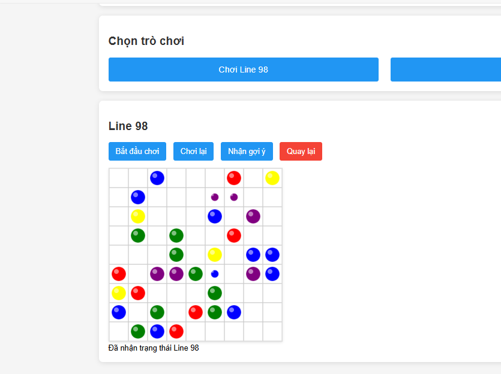
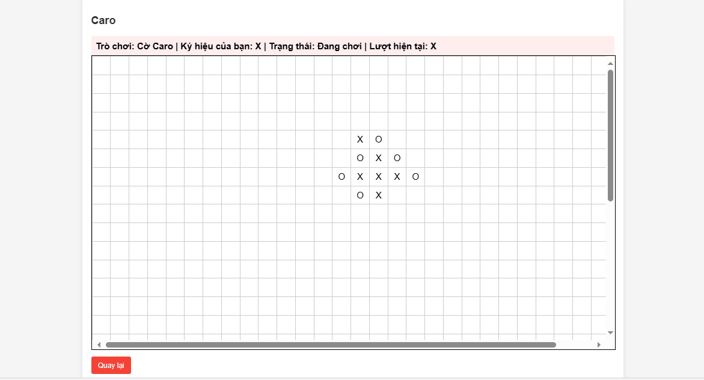

# 🎩 Nền Tảng Trò Chơi Trực Tuyến: Line 98 & Caro

Một nền tảng trò chơi trực tuyến bao gồm hai trò chơi phổ biến: **Line 98** và **Caro**. Hệ thống được xây dựng với **NestJS** cho backend, **MongoDB** để lưu trữ dữ liệu, **Socket.IO** cho giao tiếp thời gian thực, và giao diện người dùng sử dụng **HTML, CSS, JavaScript**. Ap dụng đúng mô hình **Mvc**.

---

## 🚀 Tính Năng

### ✔️ Xác Thực Người Dùng
- 📅 Đăng ký tài khoản
- 🔑 Đăng nhập
- ✏️ Cập nhật hồ sơ (email, tên, tuổi, mật khẩu)

### 🎯 Trò Chơi
- 🎯 **Line 98**: Trò chơi giải đố, xếp các bóng cùng màu đầy đủ yêu cầu chức năng: Logic di chuyển, sinh bóng, animation bóng nổ... tương tự game Line 98. Có animation phóng to các quả bóng, có animation khi lựa chọn di chuyển một quả bóng theo đúng đường đi ngắn nhất trên bản đồ hiện tại. Cung cấp tính năng trợ giúp: di chuyển một quả bóng bất kỳ để đảm bảo tối ưu nhất theo thứ tự: nổ 1 dãy > có cơ hội tạo thành 1 dãy > có thể di chuyển.
- ❌ **Caro**: Trò chơi cờ caro hỗ trợ chơi 2 chơi trực tuyến với nhau. Tính xem ai thắng và kết thúc ván đấu.

## 🧰 Công Nghệ Sử Dụng

| Thành phần                | Công nghệ                    |
|-------------------------|------------------------------|
| Backend                 | NestJS, Socket.IO, Mongoose  |
| Frontend                | HTML5, CSS3, JavaScript      |
| Cơ sở dữ liệu         | MongoDB (MongoDB Atlas)     |        
| Môi trường                | Node.js, Ngrok (tùy chọn)     |

---

## 📦 Yêu Cầu Cài Đặt

Trước khi cài đặt, hãy đảm bảo bạn đã cài:

- ✅ Node.js v16+ ([Tải Node.js](https://nodejs.org))
- ✅ Tài khoản MongoDB Atlas ([Đăng ký MongoDB](https://mongodb.com))
- ✅ Ngrok (tuỳ chọn) ([Đăng ký Ngrok](https://ngrok.com))

---

## 💾 Cài Đặt

### 1. Tải Mã Nguồn
```bash
git clone https://github.com/HHieu2003/game-line98andcaro.git
cd game-line98andcaro
```

### 22. Thiết Lập MongoDB
- Tạo cluster trong MongoDB Atlas
- Lấy URI:

```
mongodb+srv://<username>:<password>@cluster0.mongodb.net/gametest?retryWrites=true&w=majority
```

### 33. Tạo Biến Môi Trường
Tạo file `.env`:

```
PORT=3000
MONGO_URI=mongodb+srv://<username>:<password>@cluster0.mongodb.net/gametest?retryWrites=true&w=majority
JWT_SECRET=a1b2c3d4e5f6g7h8i9j0
```

(Nếu dùng Ngrok):
```
NGROK_URL=https://your-ngrok-url.ngrok-free.app
```

---

## 🚀 Chạy Ứng Dụng

### 1. Khởi Động Backend
```bash
npm run start
```
Truy cập: [http://localhost:3000](http://localhost:3000)

### 2. Truy Cập Frontend
Mở trình duyệt và truy cập trang:
```url
http://localhost:3000
```

### 3. (Tuỳ chọn) Dùng Ngrok
```bash
ngrok http 3000
```

### 📷 Ảnh DemoDemo

## Giao diện Chính



## Trò Chơi Line 98



## Trò Chơi Caro


